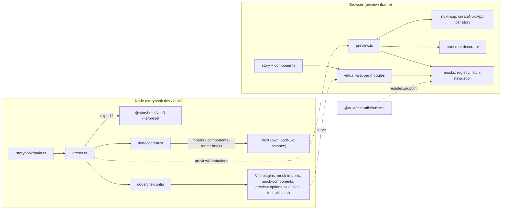
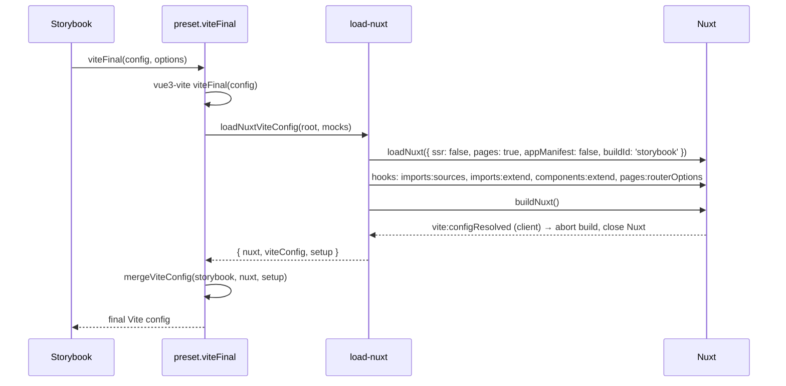
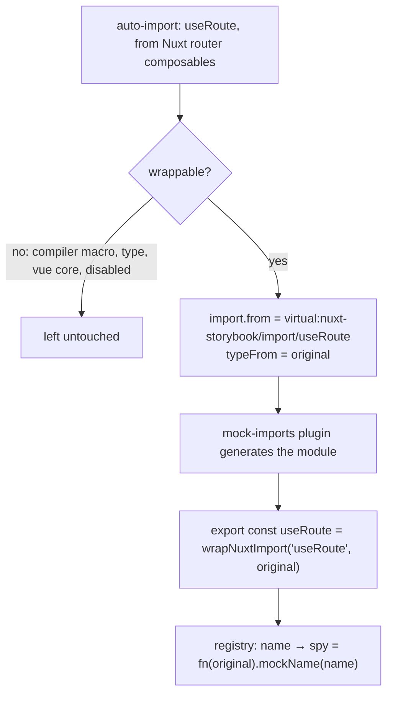
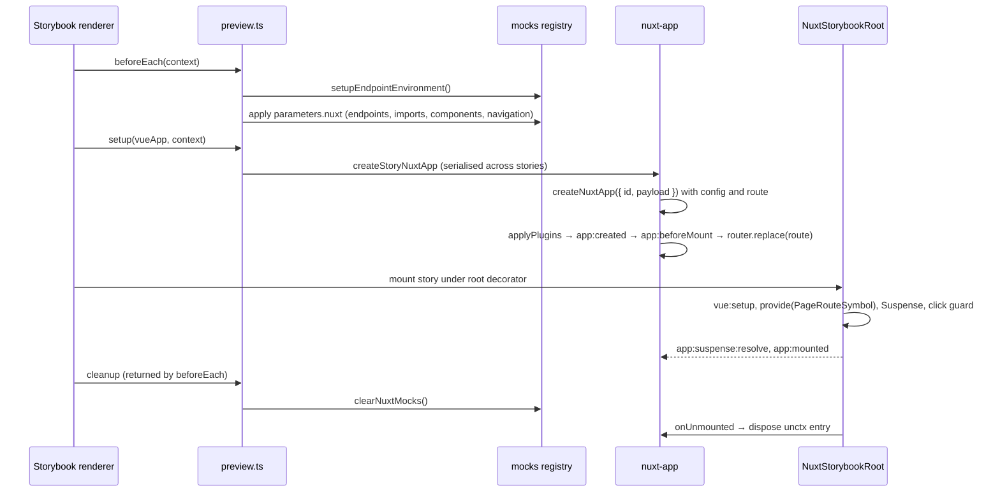
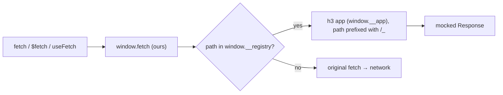
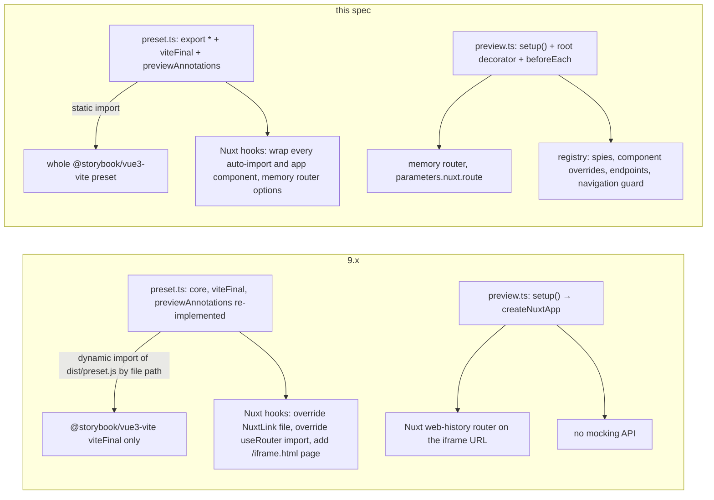
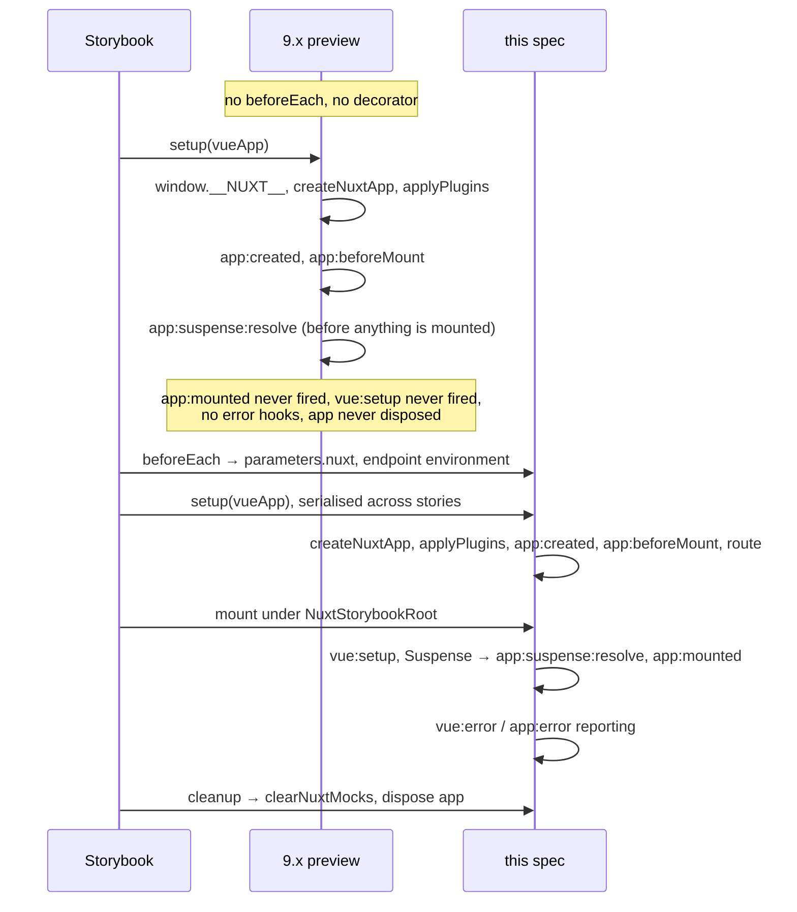

# Spec: `@storybook-vue/nuxt` framework preset

Status: draft · Branch: `refactor/addon-cleanup` (from `next`) · Targets: Storybook `^10.6`, Nuxt `^3.18.1 || ^4`, `@nuxt/test-utils` `^4.3.2`

This document specifies the architecture and public API of the rewritten framework package. Sections 1–6 are normative. Section 7 records the implementation status and what a first attempt got wrong. Section 8 compares the design with the 9.x implementation it replaces.

## 1. Goals

1. The preset is `@storybook/vue3-vite`'s preset plus Nuxt: everything the Vue preset exports is re-exported, and only what Nuxt needs is overridden.
2. Stories run inside a real Nuxt app (plugins, runtime config, router, auto-imports), one app per story.
3. Users mock Nuxt with the `@nuxt/test-utils` vocabulary (`mockNuxtImport`, `mockComponent`, `registerEndpoint`), at runtime and per story.
4. A story can never navigate the preview iframe away.
5. ESM-only, no forks of Nuxt components, no per-composable overrides.

Non-goals: SSR rendering of stories, webpack/rspack builders, `mountSuspended`/`renderSuspended` (Storybook owns rendering).

## 2. System overview



| Layer | Responsibility | Must not |
| --- | --- | --- |
| `preset.ts` | Compose the Vue preset, produce the final Vite config, register the preview entry | Contain Nuxt or Vite logic itself |
| `node/load-nuxt` | Obtain the Nuxt client Vite config; register the build-time hooks that make mocking possible | Reuse a Nuxt instance it did not create |
| `node/vite-config` | Merge Storybook + Nuxt configs; add the framework's Vite plugins | Decide what is mockable |
| `node/plugins/*` | One concern each; generate virtual modules | Import browser code |
| `preview.ts` | Storybook annotations: `decorators`, `beforeEach`, renderer re-exports, `setup()` | Hold state |
| `runtime/*` (`nuxt-app`, `nuxt-root`, `navigation`, `router.options`, `fallback-page`) | Everything that runs in the browser: boot and host one Nuxt app per story. Shipped unbundled under `dist/runtime`, which Nuxt transpiles; `preview.ts` and the index import it from there rather than inlining a copy | Know about mocks; import Node code |
| `mocks/*` | Runtime registry and the public mocking API | Depend on vitest |

### Package entry points

| Export | Audience | Content |
| --- | --- | --- |
| `@storybook-vue/nuxt` | story authors, `main.ts` | `export * from '@storybook/vue3-vite'`, the mocking API, types |
| `@storybook-vue/nuxt/preset` | Storybook | preset properties |
| `@storybook-vue/nuxt/preview` | Storybook | preview annotations |
| `@storybook-vue/nuxt/mocks` | story authors | the mocking API only |
| `@storybook-vue/nuxt/internal` | generated virtual modules | `wrapNuxtImport`, `defineMockedComponent`, `blockExternalNavigateTo`, `setupEndpointEnvironment`; no stability guarantee |

`@nuxtjs/storybook` keeps re-exporting `/preset` and `/preview` unchanged.

## 3. Build time

### 3.1 Preset contract

```ts
export * from '@storybook/vue3-vite/preset' // core, experimental_docgenProvider, experimental_manifests, …
export const viteFinal // vue3-vite viteFinal → load Nuxt → merge
export const previewAnnotations // [...entries, <absolute path to dist/preview.mjs>]
```

New properties added upstream are inherited without a release of this package.

### 3.2 Obtaining the Nuxt config



Rules for `mergeViteConfig`:

- The Nuxt config comes from an instance this package loaded and already closed, so nothing else reads it. The merge still copies `plugins` and `optimizeDeps` before writing, because `nuxtConfig` is dumped to `logs/vite-nuxt.config.json` as what Nuxt resolved.
- `vue` is aliased to the absolute `vue/dist/vue.esm-bundler.js`, by a plugin with `enforce: 'post'` (#1049).
- `@vitejs/plugin-vue` replaces Nuxt's instance; `optimizeDeps.exclude` wins over `include`; `noDiscovery: true`.
- Plugins removed from the Nuxt side: `nuxt:import-protection` / `impound` (they reject `@nuxt/test-utils/*`) and `nuxt:vitest*`.
- No dev-server proxy: the preview never forwards requests to a Nuxt server, in either mode. 9.x's `/_nuxt`, `/_ipx`, … proxy to the Nuxt dev server and its `/__storybook_preview__` rule are dropped.
- `preview-options` serves `virtual:nuxt-storybook/options` (`runtimeConfig`).
- The bare specifier `@storybook-vue/nuxt` is aliased to the index next to the preset (`dist/index.mjs`, or `src/index.ts` under `unbuild --stub`). Stories import it in the browser, and the package's own `exports` lead to a jiti loader in stub mode, which the browser cannot run. Subpaths (`/preset`, `/preview`) are not aliased. Together with `previewAnnotations` resolving from `import.meta.url`, this makes the preview load one source tree in both modes, so module-scoped state such as the `navigation` spy has a single instance.
- `@vue/test-utils` is stubbed only when it cannot be resolved from the project.

### 3.3 Making auto-imports and components mockable



- One virtual module per name: unused wrappers are tree-shaken and each pulls in only the module it wraps.
- The wrapper is a `storybook/test` spy whose default implementation is the original. Calls stay synchronous, so Vue's current instance and the Nuxt context survive.
- Non-function exports are passed through untouched.
- Excluded: compiler macros (`definePageMeta`, `defineNuxtComponent`, `defineNuxtPlugin`, …), type imports, `vue` and `#app/compat/capi`.
- Keyed composables (`useFetch`, `useAsyncData`, `useState`, …) are wrapped too; the wrapper's virtual id is registered in `optimization.keyedComposables` so Nuxt keeps injecting keys.
- A name may declare a preview-safe default implementation; `navigateTo` uses `blockExternalNavigateTo` (§4.4).
- Components: `components:extend` points app components at `virtual:nuxt-storybook/component/<PascalName>`, which exports `defineMockedComponent(name, original)`. The wrapper is transparent: no declared props or emits, attrs/listeners/slots forwarded, `expose` proxied to the rendered component, `__docgenInfo` kept. Server, island and `node_modules` components are skipped unless listed explicitly.

## 4. Runtime

### 4.1 Story lifecycle



- One Nuxt app per rendered story, keyed by the canvas element id (docs mode renders the same story id several times).
- App ids are `nuxt-app-<canvas element id>`. Storybook's canvas ids already carry the story id in docs mode (`story--<story-id>-inner`, and `--primary-inner` for the duplicate the Primary block renders), so ids are unique among the apps mounted together; the story id alone is not, because of that duplicate. In story mode the canvas is always `storybook-root`, so consecutive stories reuse one id, which is why disposal is identity-checked.
- Outside of a component, `useNuxtApp()` reads a single context keyed by the build-time app id, shared by every app on the page. unctx cannot separate the apps in a browser: there is no `AsyncLocalStorage`, and Nuxt's client path uses `set()`, which registers no async restore handler. Each app's `runWithContext` is therefore wrapped to point that context at the app first, so plugins, hooks and route middleware resolve to the app they run for. After an `await` in code that is not in a component, the context is whichever app ran last.
- The story's payload is passed to `createNuxtApp` as its `payload` option, so `window.__NUXT__` is never written and no runtime config is shared between stories. `createNuxtApp` spreads its options over the app it builds, which makes the option replace the payload as a whole: `createStoryPayload` therefore mirrors Nuxt's own shape (`data`, `state`, `once`, `_errors`, with the same reactivity) and adds `config`, `serverRendered: false` and `path`. `payload` is not a documented option of `createNuxtApp`; an ecosystem CI run against Nuxt is what will catch a change of that shape. Overwriting the app after creation is not possible: `$config` is a non-configurable getter over the config object present at creation.
- Bootstraps run one at a time, because of the shared `useNuxtApp()` context above, which is the only page-level state a bootstrap still depends on. Measured on a docs page with six stories and a probe plugin that checks `useNuxtApp()` after an `await`:

  | Boot | After an `await` in the plugin body | After an `await` in a helper the plugin calls |
  | --- | --- | --- |
  | One at a time | own app, 6 of 6 | own app, 6 of 6 |
  | Together | own app, 1 of 6 | own app, 0 of 6 |
  | Together, plugins run through unctx `callAsync` | own app, 6 of 6 | own app, 0 of 6 |

  `callAsync` registers the restore handler that Nuxt's unctx transform calls after each `await`, but the transform only rewrites the bodies of `defineNuxtPlugin` and `defineNuxtRouteMiddleware`. Code in a helper is not covered, and a browser has no `AsyncLocalStorage` to cover it. Such code works in a real Nuxt app, so booting together would break it silently. A bootstrap takes 1–4 ms in the playground, so there is nothing to gain either.
- Plugins run once per story, so plugins with global side effects must be idempotent.
- Errors: `vueApp.config.errorHandler` reports `app:error` and then defers to Storybook; the root reports `vue:error` and swallows fatal Nuxt errors like Nuxt's own root.

### 4.2 Routing

- Standalone mode loads Nuxt with `pages: true`, whether or not the app has a `pages/` directory. Nuxt's vue-router plugin is therefore the only router implementation in the preview; its minimal `window.location` / `history.pushState` router (`app/plugins/router`), which takes no options, is never used.
- `pages:routerOptions` adds `runtime/router.options`, which only sets `createMemoryHistory`. The story starts on `parameters.nuxt.route` (`/` by default); the iframe URL is never read or written.
- A catch-all page (`runtime/fallback-page`, `/:pathMatch(.*)*`) is appended through `pages:extend`. It is unconditional: Nuxt raises a fatal 404 for a location nothing matches, which an app without an index page would hit on the default route; the app's own catch-all, registered earlier, still wins the tie. It must be a real page rather than a `routes` entry of the router options, and the hook is registered before `nuxt.ready()` so it runs ahead of every module: `@nuxtjs/i18n` localises pages and its global middleware redirects any route it did not localise back to `/`, which makes every navigation fail as duplicated.
- For an app without pages, `useRoute()` / `useRouter()` return vue-router objects, a superset of the minimal router's API, and `NuxtLink` renders through `RouterLink`.
- The router is Nuxt's own plugin. This package only contributes router **options** (history, fallback route); it never creates a router, replaces `$router` or replaces `nuxtApp._route`.
- `nuxtApp._route` is Nuxt's Suspense-synced copy of `router.currentRoute`, and it is what `useRoute()` returns. Nuxt only syncs it when the matched page component is unchanged, or when `<NuxtPage>` resolves its Suspense. A story usually has no `<NuxtPage>`, so the framework calls `_route.sync()` after every navigation, unconditionally. For a story that does render `<NuxtPage>`, allows navigation and moves between two page components, the page being left therefore sees the new route slightly before it is swapped out.
- `globalThis.$fetch` is created by the bootstrap itself when it is missing, with `ofetch` and `baseURL: '/'`. Nuxt's own `#build/fetch.mjs` template, which its client entry imports, is not used: it needs the runtime config while it loads, so it cannot be a plain top-level import.
- `NuxtLink`, `useRouter`, `useRoute`, `navigateTo` are Nuxt's own. Unknown internal routes resolve to a catch-all so vue-router does not warn.

### 4.3 Endpoints



- `registerEndpoint` is re-exported from `@nuxt/test-utils/runtime`; this package supplies the window contract it needs (`window.__app`, `window.__registry`, patched `fetch` and `$fetch`).
- Unlike test-utils, unregistered URLs always pass through, so the preview keeps loading assets.
- `Request` inputs are matched by same-origin path.
- The contract is private to test-utils: a contract test runs the real `registerEndpoint` against our environment and fails on drift.

### 4.4 Navigation

A story stays on its route. Every attempt to leave it is reported to the `navigation` spy and stopped:

| Trigger | Mechanism | Reported as |
| --- | --- | --- |
| Router navigation: `NuxtLink`, `router.push`, `navigateTo(path)` | global route middleware `storybook-navigation`, registered after `app:created` so the router plugin's own navigation to `parameters.nuxt.route` is the one that goes through; it returns `false`, which vue-router turns into an aborted navigation | `to.fullPath` |
| Click on `a[href]` with a foreign http(s) origin (`NuxtLink` renders these as plain anchors, which never reach the router) | capture-phase `click` listener on the canvas element, `preventDefault()` | absolute URL |
| `navigateTo(x, { external: true })` and `navigateTo(foreignUrl)` | assign `location.href` directly; only the auto-import wrapper of §3.3 can intercept them (not implemented yet) | absolute URL |
| `mailto:`, `tel:` | untouched | — |
| `parameters.nuxt.navigation: true` | neither guard is installed; the `_route.sync()` call of §4.2 keeps `useRoute()` current | — |

## 5. Public API

### 5.1 Framework options (`.storybook/main.ts`)

```ts
/** Which parts of the Nuxt app the preview may swap out at runtime. */
export interface MocksOptions {
  /**
   * Wraps auto-imported components so `mockComponent` can replace them.
   *
   * @default true
   * @remarks An array restricts wrapping to the listed pascal names, and opts in components from packages.
   */
  components?: boolean | string[]

  /**
   * Wraps auto-imports in named spies so stories can assert calls and `mockNuxtImport` can replace them.
   *
   * @default true
   * @remarks An array restricts wrapping to the listed names.
   */
  imports?: boolean | string[]
}

/** Framework options for `@storybook-vue/nuxt`, in `.storybook/main.ts`. */
export interface FrameworkOptions extends FrameworkOptionsVue {
  /**
   * Controls the runtime mocking API.
   *
   * @default {}
   */
  mocks?: MocksOptions
}
```

### 5.2 Mocking functions

```ts
/** Replaces an auto-import for the current story; the factory receives the original. */
function mockNuxtImport<T>(name: string, factory: (original: T) => T): void

/** Replaces an auto-imported component for the current story, by pascal name or file path. */
function mockComponent(nameOrPath: string, component: Component): void

/** Answers one URL from inside the preview; same signature as `@nuxt/test-utils/runtime`. */
function registerEndpoint(
  url: string,
  options: EventHandler | { handler: EventHandler; method?: string; once?: boolean },
): () => void

/** Restores every auto-import, drops component overrides and unregisters endpoints. */
function clearNuxtMocks(): void

/** Spy called with the target of every navigation the preview blocked. */
const navigation: Mock
```

Semantics shared by all of them:

- Runtime calls, valid in `beforeEach`, `loaders`, decorators and `play`; not compile-time macros, no hoisting.
- Scoped to the story: the framework's `beforeEach` cleanup calls `clearNuxtMocks()`.
- Every wrapped auto-import is already a spy: `expect(navigateTo).toHaveBeenCalledWith('/login')` works without mocking first.
- `mockNuxtImport` throws when the name is not wrapped (excluded, disabled by `mocks.imports`, or never imported by the loaded story).

### 5.3 Story parameters

```ts
/** Declarative form of the mocking API, under `parameters.nuxt`. */
export interface NuxtParameters {
  /**
   * Components replacing auto-imported ones for this story, keyed by pascal name.
   */
  components?: Record<string, unknown>

  /**
   * Endpoints answered by the in-browser server for this story, keyed by URL.
   */
  endpoints?: Record<string, NuxtEndpoint>

  /**
   * Lets the story navigate away from its route, in the router or to another site.
   *
   * @default false
   * @remarks `false` keeps the story where it is and reports each attempt to the `navigation` spy.
   */
  navigation?: boolean

  /**
   * Factories replacing auto-imports for this story, keyed by the name user code calls.
   */
  imports?: Record<string, (original: never) => unknown>

  /**
   * Route the story's Nuxt app starts on.
   *
   * @default '/'
   */
  route?: string

  /**
   * Values merged into the app's runtime config before the story's Nuxt app is created.
   */
  runtimeConfig?: Record<string, unknown>
}
```

### 5.4 Example

```ts
import { expect, userEvent, within } from 'storybook/test'
import { mockNuxtImport, navigation } from '@storybook-vue/nuxt'
import UserCard from './UserCard.vue'

export default { component: UserCard }

export const LoggedIn = {
  parameters: {
    nuxt: {
      route: '/users/1',
      endpoints: { '/api/users/1': () => ({ name: 'Alice' }) },
    },
  },
  beforeEach() {
    mockNuxtImport('useAuth', () => () => ({ loggedIn: true }))
  },
  async play({ canvasElement }) {
    await userEvent.click(within(canvasElement).getByText('Docs'))
    await expect(navigation).toHaveBeenCalledWith('https://nuxt.com/')
  },
}
```

## 6. Compatibility

| Mode | Nuxt config | Mocks | Router |
| --- | --- | --- | --- |
| Standalone (`storybook dev` / `build`) | own `loadNuxt` | full | memory |
| Storybook Vitest addon | standalone | full (wrappers are plain Vite modules) | memory |

Embedded mode is not supported by this package: it always loads its own Nuxt instance and never looks for one running in the same process, so the config handoff `@nuxtjs/storybook` publishes under `Symbol.for('@storybook-vue/nuxt:vite-config-promise')` is no longer read. What `@nuxtjs/storybook` does about that is out of scope here.

Breaking changes against 9.x: no embedded mode; no dev-server proxy; ESM-only; `preset.js` / `preview.js` root shims removed; the forked `NuxtLink` and the `useRouter` override are gone; stories no longer see the iframe URL as their route. `sb.mock()` cannot target `#imports`, `#app/*`, `#components` or `~/` (Node resolution), and one unresolvable call disables every `sb.mock`; the docs point users to this API instead.

## 7. Implementation status

This branch holds the Node side and the mock-free half of the preview. `preset.ts` composes the Vue preset with `viteFinal` and `previewAnnotations` (§3.1); `node/load-nuxt` loads its own Nuxt instance to obtain the client Vite config, forces `pages: true` and installs the memory-history router options (§3.2 and the build-time half of §4.2); `node/vite-config` merges the two configs; `node/plugins/preview-options` serves `virtual:nuxt-storybook/options`. `preview.ts` now registers the root decorator and the `setup()` that boots one Nuxt app per story, so stories run inside a real Nuxt app.

- Implemented in the preview: the story lifecycle of §4.1 (`nuxt-app` boots a serialised app per canvas element, `nuxt-root` gives it the Suspense boundary, the `vue:setup` / `app:mounted` / `app:suspense:resolve` / `vue:error` / `app:error` hooks and the unctx disposal on unmount), the runtime half of §4.2 (`parameters.nuxt.route` through `payload.path`, plus `_route.sync()` after every navigation), the router-middleware and link-click rows of §4.4 with the `navigation` spy, and the `navigation` / `route` / `runtimeConfig` parameters of §5.3.
- Still missing: the endpoints of §4.3 and the `navigateTo` row of §4.4, and all of the mocking work (§3.3, `mocks` in §5.1, §5.2, the `components` / `endpoints` / `imports` parameters of §5.3, the `/internal` entry of §2). Consequently `loadNuxtViteConfig` takes no `mocks` argument and returns `{ nuxt, viteConfig }` rather than §3.2's `setup`; it registers no `imports:*` / `components:extend` hooks, and `node/vite-config` still keeps Nuxt's `nuxt:import-protection` / `impound` plugins and never stubs `@vue/test-utils` — those two rules of §3.2 only bite once the mocking API exists.
- `test/vite-config-merge.spec.ts` is back in the vitest include pattern, importing `mergeViteConfig` from `node/vite-config`; it encodes the #1049 rule of §3.2 and that the merge leaves `nuxtConfig` untouched for the config log. `test/proxy-config.spec.ts` was deleted together with the proxy (#1071 no longer applies). `test/load-nuxt.spec.ts` covers forced pages mode and the router options order. `test/preview-options.spec.ts` and `test/preview-annotations.spec.ts` cover the virtual module and §3.1's `previewAnnotations`. `test/navigation.spec.ts` covers the external-URL predicate, the route middleware and the click guard; the rest of the preview is covered by the playground's `Nuxt/Routing` stories.
- A first full attempt at this spec exists only as a local stash (`WIP on feat/framework-preset-rewrite`). The table below lists where it fell short of the spec; treat each row as a pitfall for the rest of the work.

| Spec | First attempt |
| --- | --- |
| §2 `/internal` entry | Not done: helpers are exported from `/mocks` |
| §3.3 keyed composables wrapped | Not done: they are excluded, so `useFetch` / `useAsyncData` / `useState` cannot be mocked or asserted. A `RegExp` `source` in `keyedComposables` is the candidate fix; unverified |
| §4.2 `_route` sync after in-story navigation | Not done: synced once at bootstrap, and only when `parameters.nuxt.route` is set, so `useRoute()` goes stale after a `NuxtLink` click |
| §4.2 forced `pages: true` | Not done: `loadNuxt` does not override `pages`, so apps without pages get Nuxt's `window.history` router and `router.options` never applies; the playground was switched to pages instead |
| Explicit `import { x } from '#imports'` | Bypasses wrappers; needs an `#imports` template override |
| Verification | Its addon build and seven fast unit specs (45 tests) passed; the full `pnpm test`, a playground `storybook build`, Playwright and a browser check of its stories were never confirmed |

## 8. Comparison with 9.x

"Before" is `packages/storybook-addon` on `main` (9.0.1): `src/preset.ts` (492 lines), `src/preview.ts`, a forked `NuxtLink` (497 lines) and a `useRouter` override.

### 8.1 Shape



### 8.2 Build time

| Area | 9.x | This spec |
| --- | --- | --- |
| Vue preset | `core` re-declared by hand; only `viteFinal` reused, loaded with `import(pathToFileURL(<pkg dir>/preset.js))`. `experimental_docgenProvider` and `experimental_manifests` were silently dropped | `export * from '@storybook/vue3-vite/preset'`; new upstream properties are inherited |
| Module format | ESM + CJS (`preset.cjs`, `index.cjs`), root `preset.js` / `preview.js` shims, `resolveModule` / `createRequire` fallbacks | ESM-only, entries resolved through `exports` |
| `previewAnnotations` | `{ bare, absolute: '' }` objects, plus rewriting every `vue3` entry to a bare specifier to dodge Storybook's path stripping | one absolute path appended; upstream entries untouched |
| Code layout | one file mixing resolver helpers, Nuxt loading, config merging, proxy and logging | `preset.ts` composes `node/load-nuxt`, `node/vite-config`, `node/plugins/*` |
| Nuxt hooks | `components:extend` swaps `NuxtLink`'s file for the fork; `addImportsSources` (priority 2) replaces `useRouter`; `extendPages` adds `/iframe.html` so the router matches the iframe URL | `imports:sources` / `imports:extend` / `components:extend` redirect to virtual wrappers; `pages:routerOptions` installs memory history. Nothing of Nuxt is replaced |
| Nuxt Vite plugins | all kept | `nuxt:import-protection` / `impound` and `nuxt:vitest*` removed (they reject the mocking API's imports) |
| Dev-server proxy | `/_nuxt`, `/_ipx`, `/api/_nuxt_icon`, devtools and island routes proxied to the Nuxt dev server when `nuxt.options.dev`, plus a `/__storybook_preview__` rewrite | none |
| Runtime config | `virtual:nuxt-runtime-config` | `virtual:nuxt-storybook/options` (`runtimeConfig`) |
| Unchanged | absolute `vue` alias (#1049), `_stop_` build abort, `noDiscovery`, React pre-bundling for docs | same behaviour, moved to `node/*` |

### 8.3 Story lifecycle



| Area | 9.x | This spec |
| --- | --- | --- |
| Nuxt app | one per story, keyed by canvas id | same, plus serialised bootstrap and disposal on unmount |
| Root component | none: the story is the root, so there is no Suspense boundary and no `PageRouteSymbol` | `NuxtStorybookRoot`, ported from `@nuxt/test-utils` |
| Hooks fired | `app:created`, `app:beforeMount`, `app:suspense:resolve` (unconditionally, pre-mount) | adds `vue:setup`, `app:mounted`, `vue:error`, `app:error`; `app:suspense:resolve` on real resolution |
| Route seen by stories | `/iframe.html?id=…` (the iframe URL, matched by the injected page) | `parameters.nuxt.route`, `/` by default |
| Navigation | pushes to the iframe's `window.history`, so the iframe URL stops pointing at the story | in memory |
| `NuxtLink` | 497-line fork of Nuxt's component that drifts with every Nuxt release | Nuxt's own |
| `useRouter` | replaced by `useNuxtApp().$router ?? useVueRouter()` | Nuxt's own |
| Navigation | internal links navigate the iframe's own history; external links unload the story | blocked (route middleware + click guard) and reported to `navigation`; opt in per story with `parameters.nuxt.navigation` |
| `$fetch` | `$fetch.create({ baseURL: '/' })` if undefined; every request hits the network or the dev proxy | same setup; no proxy; registered endpoints are answered first once §4.3 exists |
| `parameters` | none | `parameters.nuxt` |

### 8.4 Mocking

| Need | 9.x | This spec |
| --- | --- | --- |
| Replace a composable | not supported; users aliased modules in `viteFinal` by hand, and `sb.mock()` cannot resolve `#imports` / `#app` | `mockNuxtImport(name, factory)` or `parameters.nuxt.imports` |
| Assert a composable was called | not possible | every auto-import is a named spy |
| Replace a child component | global stubs through `setup((app) => app.component(...))`, which Nuxt's direct component imports bypass | `mockComponent(name, component)` or `parameters.nuxt.components` |
| Mock an API route | `msw-storybook-addon`, configured by the user | `registerEndpoint(url, handler)` or `parameters.nuxt.endpoints`; msw still works |
| Per-story runtime config or route | not supported | `parameters.nuxt.runtimeConfig`, `parameters.nuxt.route` |
| Reset between stories | n/a | automatic |

### 8.5 Costs of the new design

- Every auto-import call goes through a spy, and every app component through a wrapper component: one extra function call or vnode each, and one more frame in stack traces and Vue devtools.
- `@nuxt/test-utils` becomes a peer dependency, and `registerEndpoint` relies on its private window contract (guarded by a contract test).
- More build-time surface: two plugins generating one virtual module per wrapped auto-import and component, where 9.x had a single runtime-config module.
- Breaking for users: ESM-only, the route a story sees, and the removed `NuxtLink` / `useRouter` overrides.

